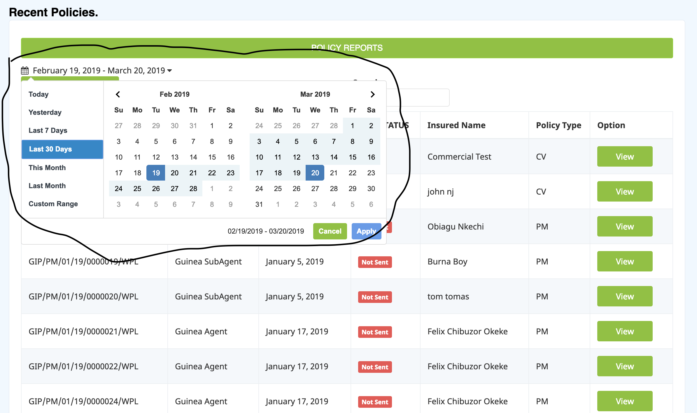

# Non-technical Documentation

## Create New Agents
Navigate to User while logged in as an **ICT STAFF** and click on `Create New` under `Agents`. Fill in the agents details.
The compulsory details are:

    firstname
    lastname
    phone
    email
The system sends the auto-generated username and password to the user mail. 

## Create New Admin(ICT, Marketer, Customer Care)
Navigate to User while logged in as an **ICT STAFF** and click on `Create New` under `ADMINS`. Fill in the admin details.
All details are compulsory.
The system sends the auto-generated username and password to the user's mail. 

## Toogle and Delete
To deactivate or activate an agent or admin navigate to the respective user type, select the user(s) you wish to toggle their status and then click on the `toggle online status` button. 

For deletion of Agents and Admins, You navigate to the `delete` button under the respective user type and click on it.(This process permanently deletes the agent from the DB along with all their transactions histories. Caution is to be taken).

## Upload Cards
To upload cards, go to the section and select the excel file and select `upload file`. 
It automatically uploads it to the database.

## Cards Management
### Activate Card
To do this enter the starting and ending values.
To activate one card, enter the same starting and ending value for it.

### Allocate Card 
Select the starting and ending serial of the cards before allocating to an agent. Note that the card must be activated first for this to be successful.

### Search Card
To do this enter the Pin of the card. 

## Policy Reports
Click on this and select any format. Each format provides an extensive date format option.

### Policy Modifications
This shows a list of all pending policy modifications. 

When you click on one, if the new details meet the standard, you can accept or decline the request.

### Add vehicles 
To add new vehicle make go to `Add vehicle make` and input the make name.

To add new vehicle model go to `Add vechicle model` and select the make before inputing the model name.
