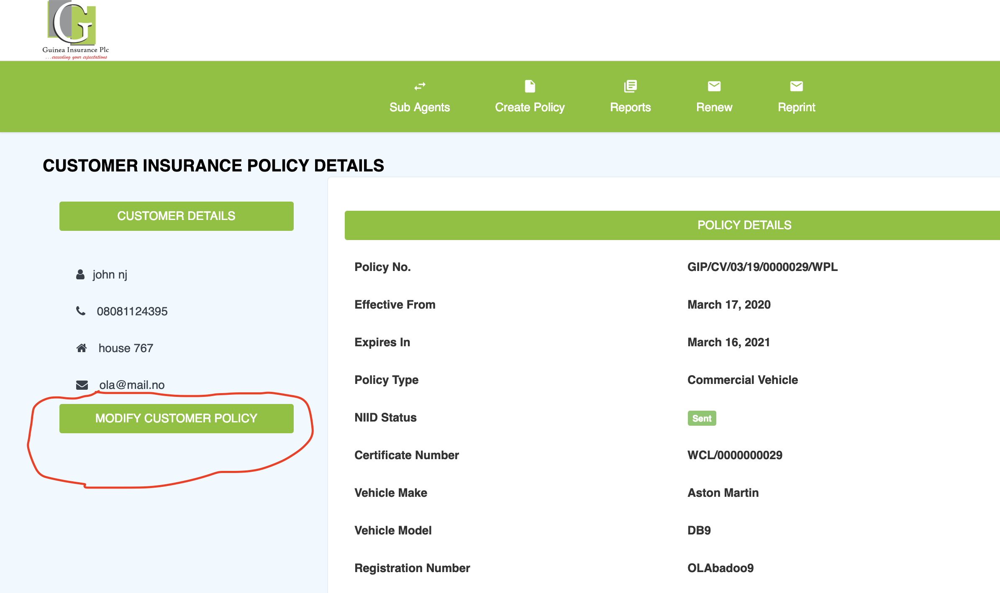

# Agent 

## Creating Policy
Follow the steps below to create a new insurance policy:

1.  Insert a card pin and insert the corresponding Insurance Class.
2.  Insert the details of the customer.
3.  Submit application.
4.  Print Insurance policy. 

## Modify Policy
To modify a policy details:

1.  Click on `reports`
2.  Find the policy and select `view`
3.  Check the `MODIFY CUSTOMER POLICY` button on the left side of the page.
    
4.  Change the modify the details and enter reason for modification and submit.

## SubAgents
To view your subagents, click on the sub-agent tab. 

To create a new subagent click on  `Create New` button and enter the agent's details.

You can also easily delete or Toggle a subagent by clicking on the button.

## Reports
This shows details of all policy created by `agent` and his `subagents`. This comes with option to print and copy to excel.

## Renew
Steps:

1.  Enter the registration number of the car.
2.  The name of the person shows with the insurance class. Enter card pin and `verify`
3.  Proceed to renew.

# Reprint
Input the registration number or policy number and click on reprint.
